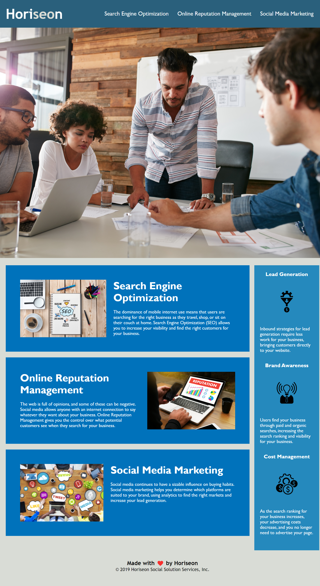

# Bootcamp Challenge 1 
## Objective:
*Refactor the existing code to make it accessible*
## Challenge 1 Acceptance Criteria:
- [x] Semantic HTML elements 
- [x] The HTML elements follow a logical structure independent of styling and positioning
- [x] The image elements have accessible alt attributes
- [x] The heading attributes fall in sequential order
- [x] A concise, descriptive title element
## Reflection:
This is my first coding challenge. Image with alternative is something can be easily ignored. Thanks to this challenge and now I will pay more attention to it in my future coding. I tried my best to refactor the code and hope I have done a good job.
## Screenshot:

## Link to Deployed Application:
